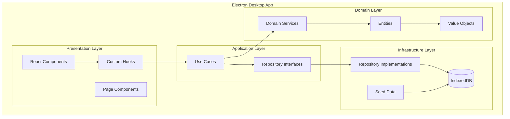
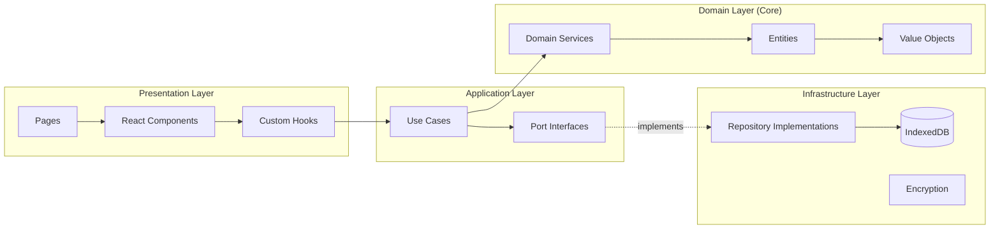
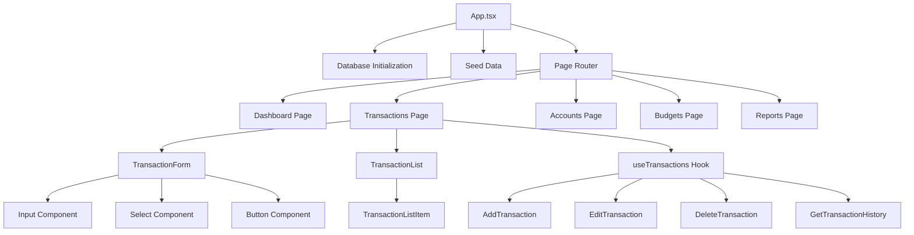
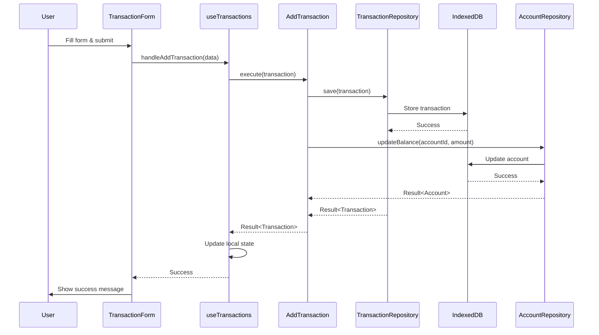
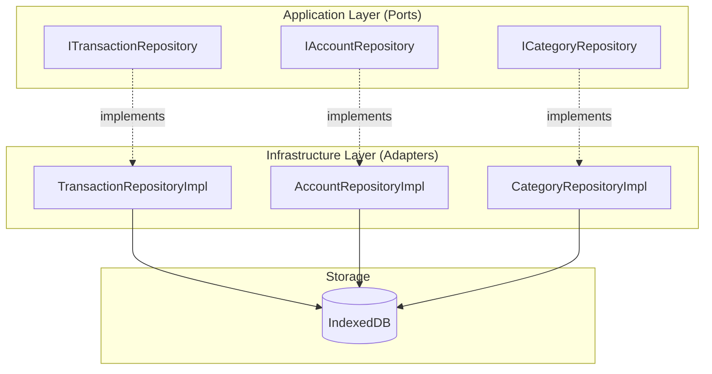
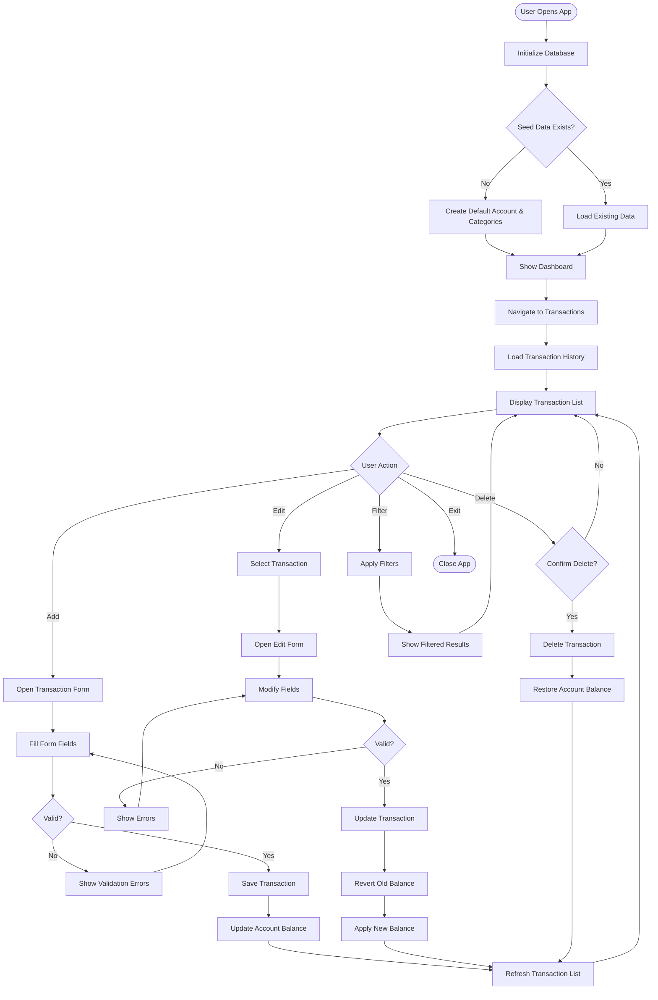

# Personal Finance Tracker - Architecture Documentation

## Table of Contents
1. [System Overview](#system-overview)
2. [Architecture Diagrams](#architecture-diagrams)
3. [Layer Descriptions](#layer-descriptions)
4. [Component Details](#component-details)
5. [Data Flow](#data-flow)
6. [Technology Stack](#technology-stack)
7. [Design Patterns](#design-patterns)
8. [Security & Privacy](#security--privacy)
9. [Performance Considerations](#performance-considerations)
10. [Testing Strategy](#testing-strategy)

---

## System Overview

The Personal Finance Tracker is a privacy-first desktop application built with Electron, React, and TypeScript. It follows Clean Architecture principles with strict separation of concerns across four distinct layers: Domain, Application, Infrastructure, and Presentation.

**Key Characteristics:**
- **Privacy-First**: All data stored locally using IndexedDB (no cloud sync)
- **Type-Safe**: TypeScript strict mode with no `any` types
- **Maintainable**: 200-line file size limit enforced
- **Tested**: Minimum 80% line coverage on business logic
- **Performant**: Sub-100ms response time for all operations
- **Explicit Error Handling**: Result<T, E> pattern, no silent failures

---

## Architecture Diagrams

### High-Level System Architecture



### Clean Architecture Layers



### Component Hierarchy



### Data Flow - Add Transaction



### Repository Pattern



---

## Layer Descriptions

### 1. Domain Layer (Core Business Logic)

**Purpose:** Contains pure business logic with no external dependencies.

**Components:**
- **Entities**: Core business objects (Transaction, Account, Category, Budget)
- **Value Objects**: Immutable types (Money, DateRange, Percentage)
- **Domain Services**: Business logic that doesn't belong to a single entity (BalanceCalculator)

**Rules:**
- No dependencies on other layers
- Pure TypeScript with no framework code
- Immutable where possible
- Explicit validation in constructors

**Key Files:**
```
src/domain/
├── entities/
│   ├── transaction.ts (169 lines)
│   ├── account.ts (172 lines)
│   ├── category.ts (145 lines)
│   └── budget.ts (180 lines)
├── value-objects/
│   ├── money.ts
│   ├── date-range.ts
│   └── percentage.ts
└── services/
    └── balance-calculator.ts (128 lines)
```

### 2. Application Layer (Use Cases)

**Purpose:** Orchestrates business logic and defines application behavior.

**Components:**
- **Use Cases**: Single-purpose operations (AddTransaction, EditTransaction, etc.)
- **Port Interfaces**: Abstract repository contracts

**Rules:**
- Depends only on Domain layer
- No UI or infrastructure code
- Returns Result<T, E> for explicit error handling
- Each use case is a single file

**Key Files:**
```
src/application/
├── use-cases/
│   └── transactions/
│       ├── add-transaction.ts (113 lines)
│       ├── edit-transaction.ts (151 lines)
│       ├── delete-transaction.ts (64 lines)
│       └── get-transaction-history.ts (89 lines)
└── ports/
    ├── transaction-repository.ts (45 lines)
    ├── account-repository.ts (38 lines)
    └── category-repository.ts (40 lines)
```

### 3. Infrastructure Layer (External Concerns)

**Purpose:** Implements technical details and external integrations.

**Components:**
- **Repository Implementations**: Concrete data access using IndexedDB
- **Database**: Schema definition and migrations
- **Seed Data**: Default accounts and categories
- **Encryption**: Data security (future)

**Rules:**
- Implements Application layer ports
- Contains all IndexedDB code
- Handles data serialization/deserialization
- No business logic

**Key Files:**
```
src/infrastructure/
└── persistence/
    ├── database.ts (199 lines)
    ├── migrations.ts (120 lines)
    ├── indexeddb-helpers.ts (25 lines)
    ├── transaction-repository-impl.ts (247 lines)
    ├── account-repository-impl.ts (189 lines)
    ├── category-repository-impl.ts (199 lines)
    └── seed-data.ts (52 lines)
```

### 4. Presentation Layer (UI)

**Purpose:** User interface and interaction logic.

**Components:**
- **Pages**: Top-level route components
- **Components**: Reusable UI elements
- **Hooks**: State management and business logic integration
- **Utils**: Formatting and validation helpers

**Rules:**
- Depends on Application layer (use cases)
- No direct database access
- Uses custom hooks for state management
- Component composition over inheritance

**Key Files:**
```
src/presentation/
├── pages/
│   └── Transactions.tsx (121 lines)
├── components/
│   ├── transactions/
│   │   ├── TransactionForm.tsx (169 lines)
│   │   ├── TransactionList.tsx (118 lines)
│   │   └── TransactionListItem.tsx (72 lines)
│   └── common/
│       ├── Button.tsx (77 lines)
│       ├── Input.tsx (77 lines)
│       ├── Select.tsx (103 lines)
│       ├── Modal.tsx (159 lines)
│       └── ErrorBoundary.tsx (115 lines)
└── hooks/
    └── useTransactions.ts (151 lines)
```

---

## Component Details

### Domain Entities

#### Transaction Entity
```typescript
class Transaction {
  id: string;
  type: 'income' | 'expense' | 'transfer';
  amount: Money;
  date: Date;
  accountId: string;
  categoryId: string;
  description: string;
  tags: string[];
  
  // Business logic methods
  isIncome(): boolean
  isExpense(): boolean
  isTransfer(): boolean
  validate(): Result<void, ValidationError>
}
```

#### Account Entity
```typescript
class Account {
  id: string;
  name: string;
  type: 'checking' | 'savings' | 'credit' | 'investment' | 'cash';
  balance: Money;
  currency: string;
  
  // Business logic methods
  canDebit(amount: Money): boolean
  debit(amount: Money): Result<Account, InsufficientFundsError>
  credit(amount: Money): Result<Account, ValidationError>
}
```

### Use Cases

#### AddTransaction Use Case
```typescript
class AddTransaction {
  constructor(
    private transactionRepo: ITransactionRepository,
    private accountRepo: IAccountRepository,
    private categoryRepo: ICategoryRepository
  ) {}
  
  async execute(data: TransactionData): Promise<Result<Transaction, Error>> {
    // 1. Validate transaction data
    // 2. Verify account exists
    // 3. Verify category exists
    // 4. Create transaction entity
    // 5. Update account balance
    // 6. Save transaction
    // 7. Return result
  }
}
```

### Custom Hooks

#### useTransactions Hook
```typescript
function useTransactions() {
  const [transactions, setTransactions] = useState<Transaction[]>([]);
  const [loading, setLoading] = useState(false);
  const [error, setError] = useState<string | null>(null);
  
  // Use case instances
  const addTransactionUC = new AddTransaction(/* repos */);
  const editTransactionUC = new EditTransaction(/* repos */);
  const deleteTransactionUC = new DeleteTransaction(/* repos */);
  const getHistoryUC = new GetTransactionHistory(/* repos */);
  
  // Handler functions
  const handleAddTransaction = async (data: TransactionData) => { /* ... */ };
  const handleEditTransaction = async (id: string, data: TransactionData) => { /* ... */ };
  const handleDeleteTransaction = async (id: string) => { /* ... */ };
  const loadTransactions = async () => { /* ... */ };
  
  return {
    transactions,
    loading,
    error,
    handleAddTransaction,
    handleEditTransaction,
    handleDeleteTransaction,
    loadTransactions
  };
}
```

---

## Data Flow

### Transaction Creation Flow

1. **User Input** → User fills TransactionForm
2. **Validation** → Form validates input (amount, date, account, category)
3. **Hook Call** → Form calls `handleAddTransaction` from useTransactions hook
4. **Use Case** → Hook executes AddTransaction use case
5. **Business Logic** → Use case validates business rules
6. **Repository** → Use case calls repository to save transaction
7. **Database** → Repository stores data in IndexedDB
8. **Balance Update** → Use case updates account balance
9. **State Update** → Hook updates local state
10. **UI Update** → React re-renders with new transaction

### Query Flow

1. **Component Mount** → Transactions page mounts
2. **Hook Init** → useTransactions hook initializes
3. **Load Data** → Hook calls `loadTransactions`
4. **Use Case** → Executes GetTransactionHistory use case
5. **Repository** → Queries IndexedDB with filters
6. **Transform** → Repository converts DB records to entities
7. **Return** → Use case returns Result<Transaction[]>
8. **State Update** → Hook updates transactions state
9. **Render** → TransactionList renders items

---

## Technology Stack

### Core Technologies
- **TypeScript 5.3+**: Type-safe development with strict mode
- **React 18.2+**: UI library with functional components and hooks
- **Electron 28+**: Desktop application framework
- **Vite 5+**: Build tool and dev server
- **Tailwind CSS 3.4.0**: Utility-first CSS framework

### Data & State
- **IndexedDB**: Browser-based NoSQL database for local storage
- **React Hooks**: State management (useState, useEffect, custom hooks)
- **Zod 3+**: Runtime type validation and schema definition

### Testing
- **Vitest 1+**: Unit testing framework
- **Testing Library**: React component testing
- **Coverage**: 80% minimum line coverage requirement

### Development Tools
- **ESLint**: Code linting with strict rules
- **Prettier**: Code formatting
- **TypeScript Compiler**: Type checking and compilation

---

## Design Patterns

### 1. Clean Architecture
**Purpose:** Separation of concerns with dependency inversion

**Implementation:**
- Domain layer has no dependencies
- Application layer depends only on Domain
- Infrastructure implements Application ports
- Presentation depends on Application

### 2. Repository Pattern
**Purpose:** Abstract data access logic

**Implementation:**
```typescript
// Port (Application Layer)
interface ITransactionRepository {
  save(transaction: Transaction): Promise<Result<Transaction, Error>>;
  findById(id: string): Promise<Result<Transaction, NotFoundError>>;
  findAll(): Promise<Result<Transaction[], Error>>;
  delete(id: string): Promise<Result<void, Error>>;
}

// Adapter (Infrastructure Layer)
class TransactionRepositoryImpl implements ITransactionRepository {
  // IndexedDB implementation
}
```

### 3. Result Pattern
**Purpose:** Explicit error handling without exceptions

**Implementation:**
```typescript
type Result<T, E extends Error> = 
  | { success: true; value: T }
  | { success: false; error: E };

// Usage
const result = await addTransaction.execute(data);
if (result.success) {
  console.log(result.value);
} else {
  console.error(result.error);
}
```

### 4. Value Object Pattern
**Purpose:** Immutable domain primitives with validation

**Implementation:**
```typescript
class Money {
  private constructor(
    private readonly amount: number,
    private readonly currency: string
  ) {}
  
  static create(amount: number, currency: string): Result<Money, ValidationError> {
    if (amount < 0) return { success: false, error: new ValidationError('Negative amount') };
    return { success: true, value: new Money(amount, currency) };
  }
  
  add(other: Money): Result<Money, ValidationError> {
    if (this.currency !== other.currency) {
      return { success: false, error: new ValidationError('Currency mismatch') };
    }
    return Money.create(this.amount + other.amount, this.currency);
  }
}
```

### 5. Custom Hook Pattern
**Purpose:** Encapsulate stateful logic and side effects

**Implementation:**
```typescript
function useTransactions() {
  const [state, setState] = useState(/* ... */);
  
  useEffect(() => {
    // Load initial data
  }, []);
  
  const operations = {
    add: async (data) => { /* ... */ },
    edit: async (id, data) => { /* ... */ },
    delete: async (id) => { /* ... */ }
  };
  
  return { state, operations };
}
```

### 6. Component Composition
**Purpose:** Build complex UIs from simple, reusable components

**Implementation:**
```typescript
// Transactions Page (Container)
<TransactionsPage>
  <TransactionForm onSubmit={handleAdd} />
  <TransactionList transactions={transactions}>
    {transactions.map(t => (
      <TransactionListItem 
        key={t.id} 
        transaction={t}
        onDelete={handleDelete}
      />
    ))}
  </TransactionList>
</TransactionsPage>
```

---

## Security & Privacy

### Privacy-First Design
- **Local-Only Storage**: All data stored in IndexedDB (no cloud sync)
- **No Telemetry**: No analytics or tracking
- **No External APIs**: Fully offline-capable
- **User Control**: Complete data ownership

### Data Security
- **Encryption** (Planned): AES-256 encryption for sensitive data
- **Content Security Policy**: Strict CSP in Electron
- **Context Isolation**: Electron preload script with context bridge
- **No eval()**: No dynamic code execution

### Input Validation
- **Zod Schemas**: Runtime validation for all user inputs
- **Type Safety**: TypeScript strict mode prevents type errors
- **Sanitization**: XSS prevention in all text inputs
- **Business Rules**: Domain entity validation

---

## Performance Considerations

### Performance Requirements
- **Response Time**: Sub-100ms for all operations (constitution requirement)
- **File Size**: Maximum 200 lines per file (maintainability)
- **Bundle Size**: Optimized with Vite code splitting
- **Memory**: Efficient IndexedDB queries with indexes

### Optimization Strategies

#### 1. IndexedDB Indexes
```typescript
// Optimized queries with indexes
const store = db.createObjectStore('transactions', { keyPath: 'id' });
store.createIndex('accountId', 'accountId', { unique: false });
store.createIndex('categoryId', 'categoryId', { unique: false });
store.createIndex('date', 'date', { unique: false });
```

#### 2. Lazy Loading
- Components loaded on-demand with React.lazy()
- Routes split into separate bundles
- Heavy computations deferred with useEffect

#### 3. Memoization
```typescript
const sortedTransactions = useMemo(() => {
  return transactions.sort((a, b) => b.date.getTime() - a.date.getTime());
}, [transactions]);
```

#### 4. Debouncing
```typescript
const debouncedSearch = useMemo(
  () => debounce((query: string) => {
    // Search logic
  }, 300),
  []
);
```

---

## Testing Strategy

### Test Coverage Requirements
- **Minimum**: 80% line coverage on business logic (constitution requirement)
- **Domain Layer**: 100% coverage (pure functions, easy to test)
- **Application Layer**: 90%+ coverage (use cases)
- **Infrastructure Layer**: 80%+ coverage (repository implementations)
- **Presentation Layer**: 70%+ coverage (components, hooks)

### Test Types

#### 1. Unit Tests
**Target:** Domain entities, value objects, services

```typescript
describe('Money', () => {
  it('should add two money values with same currency', () => {
    const m1 = Money.create(100, 'USD').value;
    const m2 = Money.create(50, 'USD').value;
    const result = m1.add(m2);
    
    expect(result.success).toBe(true);
    expect(result.value.getAmount()).toBe(150);
  });
  
  it('should fail to add money with different currencies', () => {
    const m1 = Money.create(100, 'USD').value;
    const m2 = Money.create(50, 'EUR').value;
    const result = m1.add(m2);
    
    expect(result.success).toBe(false);
    expect(result.error).toBeInstanceOf(ValidationError);
  });
});
```

#### 2. Integration Tests
**Target:** Use cases with repository implementations

```typescript
describe('AddTransaction Use Case', () => {
  let addTransaction: AddTransaction;
  let transactionRepo: TransactionRepositoryImpl;
  let accountRepo: AccountRepositoryImpl;
  
  beforeEach(async () => {
    // Setup test database
    await setupTestDB();
    transactionRepo = new TransactionRepositoryImpl();
    accountRepo = new AccountRepositoryImpl();
    addTransaction = new AddTransaction(transactionRepo, accountRepo);
  });
  
  it('should add transaction and update account balance', async () => {
    const data = {
      type: 'expense',
      amount: 50,
      accountId: 'test-account',
      categoryId: 'test-category',
      date: new Date(),
      description: 'Test transaction'
    };
    
    const result = await addTransaction.execute(data);
    
    expect(result.success).toBe(true);
    
    const account = await accountRepo.findById('test-account');
    expect(account.value.balance.getAmount()).toBe(950); // 1000 - 50
  });
});
```

#### 3. Component Tests
**Target:** React components and hooks

```typescript
describe('TransactionForm', () => {
  it('should validate required fields', async () => {
    const onSubmit = vi.fn();
    render(<TransactionForm onSubmit={onSubmit} />);
    
    const submitButton = screen.getByText('Add Transaction');
    fireEvent.click(submitButton);
    
    expect(screen.getByText('Amount is required')).toBeInTheDocument();
    expect(onSubmit).not.toHaveBeenCalled();
  });
  
  it('should submit valid transaction', async () => {
    const onSubmit = vi.fn();
    render(<TransactionForm onSubmit={onSubmit} />);
    
    fireEvent.change(screen.getByLabelText('Amount'), { target: { value: '100' } });
    fireEvent.change(screen.getByLabelText('Description'), { target: { value: 'Test' } });
    fireEvent.click(screen.getByText('Add Transaction'));
    
    await waitFor(() => {
      expect(onSubmit).toHaveBeenCalledWith(expect.objectContaining({
        amount: 100,
        description: 'Test'
      }));
    });
  });
});
```

#### 4. E2E Tests (Future)
**Target:** Complete user workflows

```typescript
describe('Transaction Management E2E', () => {
  it('should complete full transaction lifecycle', async () => {
    // 1. Launch app
    // 2. Navigate to transactions
    // 3. Add new transaction
    // 4. Verify in list
    // 5. Edit transaction
    // 6. Verify changes
    // 7. Delete transaction
    // 8. Verify removal
  });
});
```

### Test Organization
```
src/
├── domain/
│   ├── entities/
│   │   ├── transaction.ts
│   │   └── transaction.test.ts
│   └── services/
│       ├── balance-calculator.ts
│       └── balance-calculator.test.ts
├── application/
│   └── use-cases/
│       └── transactions/
│           ├── add-transaction.ts
│           └── add-transaction.test.ts
└── presentation/
    └── components/
        └── transactions/
            ├── TransactionForm.tsx
            └── TransactionForm.test.tsx
```

---

## Workflow Diagram



---

## Future Enhancements

### Phase 4: Account Management
- Multiple account support
- Account transfers
- Account reconciliation
- Account archiving

### Phase 5: Budget Tracking
- Budget creation and management
- Budget vs actual tracking
- Budget alerts and notifications
- Rollover budgets

### Phase 6: Reports & Analytics
- Spending trends
- Category breakdowns
- Income vs expense charts
- Custom date ranges
- Export to PDF/CSV

### Phase 7: Data Management
- Import from CSV/OFX
- Export to various formats
- Backup and restore
- Data encryption

### Phase 8: Recurring Transactions
- Scheduled transactions
- Recurring patterns
- Auto-execution
- Reminder notifications

### Phase 9: Advanced Features
- Multi-currency support
- Investment tracking
- Tax reporting
- Mobile companion app (future)

---

## Conclusion

The Personal Finance Tracker follows a robust, maintainable architecture that prioritizes:

1. **Privacy**: Local-only data storage with no external dependencies
2. **Type Safety**: TypeScript strict mode throughout
3. **Maintainability**: Clean Architecture with clear separation of concerns
4. **Testability**: High test coverage with explicit error handling
5. **Performance**: Sub-100ms operations with optimized queries
6. **Extensibility**: Easy to add new features without breaking existing code

The architecture supports the current MVP implementation and provides a solid foundation for future enhancements while maintaining code quality and adherence to constitutional principles.