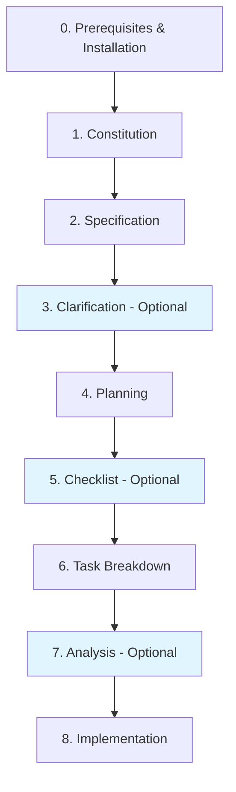
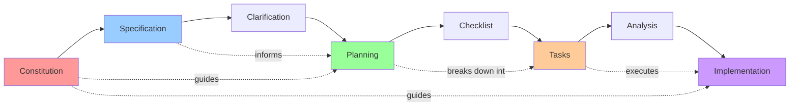

# Spec-Driven Development with Spec-Kit: Complete Guide

## Overview

Spec-Driven Development **flips traditional software development** by making specifications executable and the source of truth, rather than just documentation that gets discarded after coding begins. It's a structured, 8-phase workflow that ensures quality through systematic planning and implementation.

## Table of Contents

- [The 8-Phase Workflow](#the-8-phase-workflow)
- [Architecture Diagram](#architecture-diagram)
- [Step-by-Step Guide](#step-by-step-guide)
- [Key Principles](#key-principles)
- [Best Practices](#best-practices)
- [Example Workflow](#example-workflow)
- [When to Use](#when-to-use)
- [Resources](#resources)

## The 8-Phase Workflow



| Phase | Type | Purpose |
|-------|------|---------|
| 0. Prerequisites | Setup | Install tools and initialize project |
| 1. Constitution | Required | Define project principles and standards |
| 2. Specification | Required | Define WHAT to build (requirements) |
| 3. Clarification | Optional | Resolve ambiguities before planning |
| 4. Planning | Required | Define HOW to build (tech stack) |
| 5. Checklist | Optional | Validate requirements completeness |
| 6. Task Breakdown | Required | Generate actionable tasks |
| 7. Analysis | Optional | Validate coverage and consistency |
| 8. Implementation | Required | Execute tasks systematically |

## Architecture Diagram



## Step-by-Step Guide

### Phase 0: Prerequisites & Installation

#### Required Tools

```bash
# Check prerequisites
python3 --version  # Must be 3.11+
uv --version       # Package manager
git --version      # Version control
```

#### Install uv (if needed)

```bash
# Linux/macOS
curl -LsSf https://astral.sh/uv/install.sh | sh

# Windows
powershell -c "irm https://astral.sh/uv/install.ps1 | iex"
```

#### Install Spec-Kit CLI

**Important:** The `uv tool install` command installs `specify-cli` **globally** in an isolated environment managed by `uv`. This is the recommended approach - you do NOT need to create or activate a virtual environment manually.

**How it works:**
- `uv tool install` creates an isolated environment automatically
- The tool is available globally in your system PATH
- Each tool gets its own isolated dependencies
- No conflicts with other Python projects
- No need to activate/deactivate environments

```bash
# Install from main branch (globally, in isolated environment)
uv tool install specify-cli --from git+https://github.com/github/spec-kit.git

# Or install specific version (replace vX.Y.Z with actual version)
uv tool install specify-cli --from git+https://github.com/github/spec-kit.git@vX.Y.Z

# Verify installation (available globally)
specify version
```

**Alternative: Using pipx (if you prefer)**

If you don't want to use `uv`, you can use `pipx` which works similarly:

```bash
# Install with pipx (also creates isolated environment)
pipx install git+https://github.com/github/spec-kit.git

# Verify installation
specify version
```

**Why NOT use a virtual environment?**
- ❌ `specify-cli` is a CLI tool, not a project dependency
- ❌ You'd need to activate the venv every time you use it
- ❌ It's meant to be available system-wide
- ✅ `uv tool install` handles isolation automatically
- ✅ Works across all your projects without activation

#### Initialize Project

```bash
# Initialize in current directory
echo "y" | specify init . --ai bob

# Verify setup
specify check
```

**What this creates:**
- `.specify/` directory structure
- Slash commands for Bob (`/speckit.*`)
- Templates for specifications, plans, and tasks
- Scripts for workflow automation

---

### Phase 1: Constitution 📜

**Purpose:** Establish governing principles (coding standards, testing, architecture, error handling, naming, performance, decision rules)

**Command:**
```bash
/speckit.constitution
```

**Example Prompt:**
```
Create principles for a personal finance tracker:
- TypeScript strict mode, no 'any', functional style preferred
- File size limit: 200 lines per file
- Minimum 80% line coverage on business logic
- Privacy-first: all data stored locally
- Clean architecture with clear separation of concerns
- Error handling: explicit error types, no silent failures
- Performance: sub-100ms response time for all operations
```

**Output:** `.specify/memory/constitution.md`

**Key Points:**
- ✅ Define non-negotiable standards
- ✅ Establish decision-making framework
- ✅ Set quality benchmarks
- ✅ Guide all subsequent phases

---

### Phase 2: Specification 📝

**Purpose:** Define WHAT to build (user needs, functional requirements, user stories, edge cases, out of scope)

**Command:**
```bash
/speckit.specify
```

**Example Prompt:**
```
Build a photo album organizer that helps users organize photos into albums.

User Stories:
- As a user, I want to create albums grouped by date
- As a user, I want to drag-and-drop to reorganize albums
- As a user, I want to view photos in a tile interface within albums
- As a user, I want to add/remove photos from albums
- As a user, I want to rename albums
- As a user, I want to search photos by date or tags

Constraints:
- Albums are never nested (flat structure only)
- Photos can belong to multiple albums
- All operations must work offline

Out of Scope:
- Photo editing capabilities
- Cloud synchronization
- Sharing albums with other users
```

**Output:** `specs/[feature-number]-[feature-name]/spec.md` + automatic branch creation

**Critical Rule:** Focus on WHAT and WHY, NOT HOW or tech stack

**What to Include:**
- ✅ User stories
- ✅ Functional requirements
- ✅ Edge cases
- ✅ Boundaries (what's out of scope)
- ❌ Technology choices
- ❌ Implementation details
- ❌ Architecture decisions

---

### Phase 3: Clarification ❓

**Purpose:** Identify and resolve ambiguities, edge cases before planning

**Command:**
```bash
/speckit.clarify
```

**When to Use:**
- ✅ Before planning (reduces rework)
- ✅ When requirements feel vague
- ✅ For complex features
- ✅ When multiple interpretations exist

**What It Does:**
- Analyzes specification for ambiguities
- Asks targeted, sequential questions
- Records answers in Clarifications section
- Updates spec.md with resolved details

**Example Questions It Might Ask:**
- "What happens when a user tries to delete an album with photos?"
- "Should photos maintain their order within albums?"
- "What's the maximum number of photos per album?"
- "How should the system handle duplicate photo uploads?"

**Output:** Updated `spec.md` with clarifications section

---

### Phase 4: Planning 🏗️

**Purpose:** Define HOW to build (tech stack, architecture, database, API design, testing, deployment)

**Command:**
```bash
/speckit.plan
```

**Example Prompt:**
```
Technical Implementation:
- Frontend: React with TypeScript, Vite build tool
- Styling: Tailwind CSS for responsive design
- State Management: Zustand for simplicity
- Database: IndexedDB for local storage
- File Handling: File System Access API
- Testing: Vitest for unit tests, Playwright for E2E
- Architecture: Clean architecture with clear layers
  - Presentation Layer (React components)
  - Application Layer (use cases)
  - Domain Layer (business logic)
  - Infrastructure Layer (storage, file access)
```

**Output Files:**
- `plan.md` - Technical implementation plan
- `data-model.md` - Database schema and relationships
- `research.md` - Technology research and decisions
- `contracts/` - API specifications (if applicable)
- `quickstart.md` - Setup and development instructions

**Key Points:**
- ✅ Reference constitution principles
- ✅ Align tech choices with requirements
- ✅ Document architectural decisions
- ✅ Include testing strategy
- ✅ Define deployment approach

---

### Phase 5: Checklist ✅

**Purpose:** Validate requirements completeness, clarity, and consistency

**Command:**
```bash
/speckit.checklist
```

**When to Use:**
- After planning, before task breakdown
- For quality-critical projects
- When requirements are complex
- To ensure nothing is missed

**What It Validates:**
- ✅ All user stories have acceptance criteria
- ✅ Edge cases are documented
- ✅ Requirements are testable
- ✅ No conflicting requirements
- ✅ Technical feasibility confirmed
- ✅ Performance requirements defined
- ✅ Security considerations addressed

**Output:** Quality validation checklist (like "unit tests for English")

---

### Phase 6: Task Breakdown 📋

**Purpose:** Convert plan into ordered, actionable tasks

**Command:**
```bash
/speckit.tasks
```

**Output:** `specs/[feature]/tasks.md`

**Task Structure:**
```markdown
# Task List: Photo Album Organizer

## Phase 1: Data Model & Infrastructure
- [ ] Task 1.1: Define Album entity with properties (id, name, date, photoIds)
  - Files: `src/domain/entities/Album.ts`
  - Acceptance: Album entity with validation
  
- [ ] Task 1.2: Define Photo entity with metadata
  - Files: `src/domain/entities/Photo.ts`
  - Acceptance: Photo entity with tags, date, file reference

- [P] Task 1.3: Implement IndexedDB repository for Albums
  - Files: `src/infrastructure/repositories/AlbumRepository.ts`
  - Acceptance: CRUD operations with error handling

- [P] Task 1.4: Implement IndexedDB repository for Photos
  - Files: `src/infrastructure/repositories/PhotoRepository.ts`
  - Acceptance: CRUD operations with file references

## Phase 2: Core Business Logic
- [ ] Task 2.1: Implement CreateAlbum use case
  - Files: `src/application/usecases/CreateAlbum.ts`
  - Tests: `src/application/usecases/CreateAlbum.test.ts`
  - Acceptance: Creates album with validation

[... more tasks ...]

## Checkpoint 1: Data Layer Validation
- [ ] Verify all entities persist correctly
- [ ] Test repository error handling
- [ ] Validate data model relationships
```

**Task Ordering:**
1. Data models
2. Repositories
3. Services/Use cases
4. Components
5. Tests (TDD approach)
6. Checkpoints

**Task Markers:**
- `[ ]` - Pending
- `[x]` - Completed
- `[P]` - Can run in parallel

---

### Phase 7: Analysis 🔍

**Purpose:** Cross-artifact consistency check

**Command:**
```bash
/speckit.analyze
```

**When to Use:**
- After task breakdown, before implementation
- For complex features
- When multiple developers are involved
- To catch gaps early

**What It Validates:**

| Check | Description |
|-------|-------------|
| ✅ Spec Coverage | All requirements have corresponding tasks |
| ✅ Data Model Completeness | All entities and relationships defined |
| ✅ Plan Alignment | Plan follows constitution principles |
| ✅ Test Coverage | Tests exist for all business logic |
| ✅ Constitution Compliance | Implementation matches standards |
| ✅ Dependency Order | Tasks respect dependencies |

**Output:** Analysis report with ✅ / ⚠️ / ❌ items

**Action Required:**
- Fix all ❌ issues before implementation
- Address ⚠️ warnings if critical
- Document decisions for any accepted gaps

---

### Phase 8: Implementation 🚀

**Purpose:** Execute tasks systematically from tasks.md

**Command:**
```bash
/speckit.implement
```

**Implementation Rules:**

1. **Work in Order**
   - Follow task sequence strictly
   - Respect dependencies
   - Execute parallel tasks `[P]` together

2. **Pause After Every 5 Tasks**
   - Review progress
   - Test functionality
   - Get user approval before continuing

3. **Write Complete Code**
   - Production-ready, not pseudocode
   - Include error handling
   - Add comments for complex logic
   - Follow constitution standards

4. **Check Off Tasks**
   - Mark completed tasks with `[x]`
   - Update progress in tasks.md
   - Document any deviations

5. **Create Stubs for Dependencies**
   - If a dependency isn't ready, create a stub
   - Document stub behavior
   - Replace with real implementation later

6. **Validate Checkpoints**
   - Test functionality at each checkpoint
   - Fix issues before proceeding
   - Get user confirmation

**Progress Tracking:**
```markdown
## Phase 1: Data Model & Infrastructure
- [x] Task 1.1: Define Album entity ✓
- [x] Task 1.2: Define Photo entity ✓
- [x] Task 1.3: Implement AlbumRepository ✓
- [x] Task 1.4: Implement PhotoRepository ✓

## Checkpoint 1: Data Layer Validation ✓
- [x] All entities persist correctly
- [x] Repository error handling tested
- [x] Data model relationships validated

## Phase 2: Core Business Logic (IN PROGRESS)
- [x] Task 2.1: CreateAlbum use case ✓
- [-] Task 2.2: AddPhotoToAlbum use case (in progress)
- [ ] Task 2.3: RemovePhotoFromAlbum use case
```

**Important:** Only mark the overall task as complete when ALL implementation tasks are finished and the feature is fully built.

---

## Key Principles

### 🎯 Separation of Concerns

| Phase | Focus | Avoid |
|-------|-------|-------|
| **Specification** | WHAT to build | HOW to build it |
| **Planning** | HOW to build | Actual implementation |
| **Implementation** | Building it | Changing requirements |

### 🔄 Iterative Refinement

- Not one-shot generation
- Multiple refinement cycles
- User approval at each phase
- Continuous validation

### 📊 Traceability

```
Constitution → Guides → Planning
     ↓                      ↓
Specification → Informs → Tasks → Executes → Implementation
```

Every decision is:
- ✅ Documented
- ✅ Traceable to requirements
- ✅ Aligned with constitution
- ✅ Validated at checkpoints

### ✋ User Control

**Mandatory Confirmation Rule:**

For EVERY `/speckit.*` command:
1. Present the command with pre-filled data
2. Explain what it will create/do
3. Ask: "Would you like me to proceed, or modify anything?"
4. WAIT for explicit approval
5. Execute only after confirmation
6. Verify output files created correctly

**Never:**
- ❌ Execute without approval
- ❌ Assume user wants to proceed
- ❌ Skip confirmation step
- ❌ Run commands in terminal (use Bob chat)

---

## Best Practices

### ✅ Do:

1. **Create constitution before specification**
   - Establishes standards first
   - Guides all decisions
   - Prevents rework

2. **Use clarification to resolve ambiguities**
   - Reduces planning errors
   - Catches edge cases early
   - Improves specification quality

3. **Run analysis before implementation**
   - Identifies gaps
   - Validates consistency
   - Prevents missing requirements

4. **Test incrementally**
   - After each task
   - At every checkpoint
   - Before moving to next phase

5. **Pause for review after every 5 tasks**
   - Catch issues early
   - Validate progress
   - Adjust if needed

6. **Follow command sequence strictly**
   - Each phase builds on previous
   - Skipping phases causes problems
   - Optional phases are still valuable

### ❌ Don't:

1. **Skip the constitution**
   - Leads to inconsistent decisions
   - No quality standards
   - Difficult to maintain

2. **Mix WHAT and HOW in specifications**
   - Specification: user needs, requirements
   - Planning: tech stack, architecture
   - Keep them separate

3. **Assume command execution without approval**
   - Always wait for confirmation
   - User must review and approve
   - Transparency is critical

4. **Write pseudocode**
   - Write production-ready code
   - Include error handling
   - Follow coding standards

5. **Skip optional quality gates without consideration**
   - Clarification prevents ambiguity
   - Checklist ensures completeness
   - Analysis validates consistency

6. **Proceed with ❌ issues from analysis**
   - Fix critical issues first
   - Address warnings if important
   - Document accepted gaps

---

## Example Workflow

### Building a Task Manager Application

#### 1. Constitution
```bash
/speckit.constitution

Create principles for a team task manager:
- TypeScript strict mode, no 'any' types
- React with functional components only
- 80% minimum test coverage
- Mobile-first responsive design
- Clean architecture (presentation, application, domain, infrastructure)
- Real-time updates required
- Accessibility: WCAG 2.1 AA compliance
- Performance: < 100ms UI response time
```

#### 2. Specification
```bash
/speckit.specify

Build Taskify, a team productivity platform.

User Stories:
- As a team member, I want to create projects so I can organize work
- As a team member, I want to add tasks to projects with descriptions
- As a team member, I want to assign tasks to team members
- As a team member, I want to move tasks between Kanban columns (To Do, In Progress, In Review, Done)
- As a team member, I want to comment on tasks for collaboration
- As a team member, I want to see my assigned tasks highlighted

Initial Scope:
- 5 predefined users (1 PM, 4 engineers)
- 3 sample projects
- No authentication (select user at startup)
- Standard Kanban columns

Constraints:
- Tasks can only be in one column at a time
- Users can edit/delete only their own comments
- Tasks must show assignment and status clearly

Out of Scope:
- User registration/authentication
- Email notifications
- File attachments
- Time tracking
```

#### 3. Clarification (Optional)
```bash
/speckit.clarify

# System asks questions like:
# - "Should tasks have due dates?"
# - "Can tasks be moved between projects?"
# - "What happens to comments when a task is deleted?"
# - "Should there be a limit on comment length?"
```

#### 4. Planning
```bash
/speckit.plan

Technical Implementation:
- Frontend: React 18 with TypeScript, Vite
- State Management: Zustand for simplicity
- Styling: Tailwind CSS
- Backend: Supabase (PostgreSQL + real-time)
- Real-time: Supabase subscriptions
- Drag-and-Drop: @dnd-kit/core
- Testing: Vitest + React Testing Library + Playwright
- Deployment: Vercel

Architecture:
- Clean Architecture layers
- Repository pattern for data access
- Use cases for business logic
- React components for presentation
- Real-time event handlers in infrastructure layer

Database Schema:
- users (id, name, role)
- projects (id, name, created_at)
- tasks (id, project_id, title, description, status, assigned_to, created_at)
- comments (id, task_id, user_id, content, created_at)
```

#### 5. Checklist (Optional)
```bash
/speckit.checklist

# Generates validation checklist:
# ✅ All user stories have acceptance criteria
# ✅ Edge cases documented (empty states, errors)
# ✅ Real-time requirements specified
# ✅ Accessibility requirements defined
# ✅ Performance benchmarks set
```

#### 6. Tasks
```bash
/speckit.tasks

# Generates ordered task list:
# Phase 1: Data Model
#   - Define entities (User, Project, Task, Comment)
#   - Create database schema
#   - Set up Supabase client
# Phase 2: Repositories
#   - Implement ProjectRepository
#   - Implement TaskRepository
#   - Implement CommentRepository
# Phase 3: Use Cases
#   - CreateProject, CreateTask, AssignTask
#   - MoveTask, AddComment, DeleteComment
# Phase 4: Components
#   - ProjectList, KanbanBoard, TaskCard
#   - CommentSection, UserSelector
# Phase 5: Real-time
#   - Set up Supabase subscriptions
#   - Handle real-time updates
# Phase 6: Testing
#   - Unit tests for use cases
#   - Integration tests for repositories
#   - E2E tests for user flows
```

#### 7. Analysis (Optional)
```bash
/speckit.analyze

# Validates:
# ✅ All user stories have corresponding tasks
# ✅ Data model supports all requirements
# ✅ Real-time updates covered
# ✅ Tests planned for all business logic
# ✅ Accessibility requirements addressed
```

#### 8. Implementation
```bash
/speckit.implement

# Executes tasks in order:
# - Creates entities and repositories
# - Implements use cases with tests
# - Builds React components
# - Sets up real-time subscriptions
# - Runs tests at checkpoints
# - Pauses every 5 tasks for review
```

---

## When to Use Spec-Driven Development

### ✅ Ideal For:

| Scenario | Why It Works |
|----------|--------------|
| **Greenfield Projects** | Start with proper foundations, standards, and architecture |
| **Brownfield Development** | Add features systematically while maintaining consistency |
| **Complex Features** | Break down complexity through structured planning |
| **Team Collaboration** | Shared understanding through documented specs and plans |
| **Quality-Critical Apps** | High reliability through systematic validation and testing |
| **Learning Projects** | Understand systematic problem-solving and decision-making |
| **Enterprise Applications** | Meet compliance, traceability, and audit requirements |

### ❌ Not Ideal For:

| Scenario | Why It's Overkill |
|----------|-------------------|
| **Quick Prototypes** | Too much overhead for throwaway code |
| **Trivial Scripts** | One-file utilities don't need full workflow |
| **Exploratory Coding** | Discovery phase needs flexibility |
| **Emergency Hotfixes** | Time-critical fixes need speed |
| **Proof of Concepts** | Validation experiments need rapid iteration |

---

## Command Reference

### Installation Commands

```bash
# Install uv
curl -LsSf https://astral.sh/uv/install.sh | sh

# Install spec-kit
uv tool install specify-cli --from git+https://github.com/github/spec-kit.git

# Check version
specify version

# Initialize project
specify init . --ai bob

# Verify setup
specify check
```

### Workflow Commands (in order)

```bash
/speckit.constitution  # 1. Project principles (REQUIRED)
/speckit.specify       # 2. Requirements (REQUIRED)
/speckit.clarify       # 3. Resolve ambiguities (OPTIONAL)
/speckit.plan          # 4. Technical design (REQUIRED)
/speckit.checklist     # 5. Quality checklist (OPTIONAL)
/speckit.tasks         # 6. Task breakdown (REQUIRED)
/speckit.analyze       # 7. Validate coverage (OPTIONAL)
/speckit.implement     # 8. Execute implementation (REQUIRED)
```

### Additional Commands

```bash
# Convert tasks to GitHub issues
/speckit.taskstoissues

# List available extensions
specify extension search

# Install extension
specify extension add <extension-name>

# List available presets
specify preset search

# Install preset
specify preset add <preset-name>
```

---

## Project Structure

After initialization, your project will have this structure:

```
project-root/
├── .specify/
│   ├── memory/
│   │   └── constitution.md          # Project principles
│   ├── scripts/
│   │   └── bash/
│   │       ├── check-prerequisites.sh
│   │       ├── common.sh
│   │       ├── create-new-feature.sh
│   │       ├── setup-plan.sh
│   │       └── setup-tasks.sh
│   ├── templates/
│   │   ├── spec-template.md         # Specification template
│   │   ├── plan-template.md         # Planning template
│   │   └── tasks-template.md        # Tasks template
│   ├── extensions/                  # Installed extensions
│   └── presets/                     # Installed presets
├── specs/
│   └── 001-feature-name/
│       ├── spec.md                  # Feature specification
│       ├── plan.md                  # Technical plan
│       ├── data-model.md            # Database schema
│       ├── research.md              # Technology research
│       ├── tasks.md                 # Task breakdown
│       ├── quickstart.md            # Setup instructions
│       └── contracts/               # API specifications
│           └── api-spec.json
├── src/                             # Source code (created during implementation)
└── README.md
```

---

## Troubleshooting

### Installation Issues

**Problem:** `uv` not found
```bash
# Solution: Install uv
curl -LsSf https://astral.sh/uv/install.sh | sh
# Restart terminal
```

**Problem:** Python version too old
```bash
# Solution: Install Python 3.11+
python3 --version
# Install from python.org or use pyenv
```

**Problem:** `specify` command not found
```bash
# Solution: Ensure uv bin directory is in PATH
echo 'export PATH="$HOME/.local/bin:$PATH"' >> ~/.bashrc
source ~/.bashrc
```

### Workflow Issues

**Problem:** Specification too vague
```bash
# Solution: Use /speckit.clarify
/speckit.clarify
# Add more detail to user stories
# Define edge cases explicitly
# Specify what's OUT OF SCOPE
```

**Problem:** Plan doesn't match constitution
```bash
# Solution: Review and align
# 1. Review constitution principles
# 2. Explicitly reference constitution in planning prompt
# 3. Ask agent to validate plan against constitution
```

**Problem:** Tasks missing requirements
```bash
# Solution: Run analysis
/speckit.analyze
# Fix identified gaps
# Add missing tasks to tasks.md
# Ensure every requirement has corresponding task
```

**Problem:** Implementation errors
```bash
# Solution: Systematic debugging
# 1. Check browser console for runtime errors
# 2. Verify all dependencies installed
# 3. Run tests after each task
# 4. Validate checkpoints before proceeding
# 5. Review constitution for standards compliance
```

---

## Advanced Topics

### Extensions

Extensions add new capabilities to Spec-Kit:

```bash
# Search extensions
specify extension search

# Install extension
specify extension add <extension-name>

# List installed extensions
specify extension list

# Remove extension
specify extension remove <extension-name>
```

**Use extensions when you need:**
- Domain-specific workflows
- External tool integration
- New development phases
- Custom commands

### Presets

Presets customize how Spec-Kit works:

```bash
# Search presets
specify preset search

# Install preset
specify preset add <preset-name>

# List installed presets
specify preset list

# Remove preset
specify preset remove <preset-name>
```

**Use presets when you want to:**
- Enforce organizational standards
- Adapt to specific methodologies (Agile, Waterfall, etc.)
- Localize to different languages
- Customize template formats

### Priority Resolution

Templates are resolved at runtime (top-down):

1. **Project-Local Overrides** (`.specify/templates/overrides/`)
2. **Presets** (`.specify/presets/templates/`)
3. **Extensions** (`.specify/extensions/templates/`)
4. **Spec Kit Core** (`.specify/templates/`)

Commands are applied at install time (highest priority wins).

---

## Resources

### Official Resources

- **GitHub Repository:** https://github.com/github/spec-kit
- **Documentation:** https://github.github.io/spec-kit/
- **Video Overview:** https://www.youtube.com/watch?v=a9eR1xsfvHg
- **Installation Guide:** https://github.github.io/spec-kit/installation.html
- **CLI Reference:** https://github.github.io/spec-kit/reference/overview.html

### Community Resources

- **Community Extensions:** https://github.github.io/spec-kit/community/extensions.html
- **Community Presets:** https://github.github.io/spec-kit/community/presets.html
- **Community Walkthroughs:** https://github.github.io/spec-kit/community/walkthroughs.html
- **Community Friends:** https://github.github.io/spec-kit/community/friends.html

### Supported AI Agents

Spec-Kit works with 30+ AI coding agents:
- GitHub Copilot
- Claude Code
- Cursor
- Gemini CLI
- Codex CLI
- And many more...

See full list: https://github.github.io/spec-kit/reference/integrations.html

---

## Summary

Spec-Driven Development with spec-kit provides a systematic approach to building high-quality software:

1. **Start with principles** (constitution)
2. **Define requirements clearly** (specification)
3. **Resolve ambiguities** (clarification)
4. **Plan technically** (planning)
5. **Validate quality** (checklist)
6. **Break down work** (tasks)
7. **Check consistency** (analysis)
8. **Execute systematically** (implementation)

This methodology ensures:
- ✅ Clear requirements documentation
- ✅ Systematic task breakdown
- ✅ Incremental validation
- ✅ Quality assurance through checkpoints
- ✅ Traceability from requirements to implementation
- ✅ Maintainable, high-quality code

**Remember:** Specifications are the source of truth, not just documentation. Build with intention, validate continuously, and maintain alignment throughout the development lifecycle.